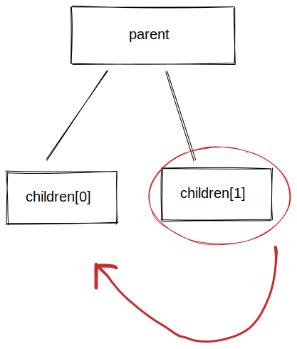
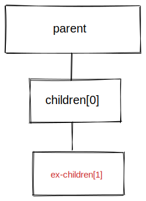

# Navigate the DOM tree

This will be a short one!

## It's not just a parent-child relationship

The dom tree consists of parent nodes containing child nodes, but child nodes also posess a bond to their sibling.

In the chart below you'll see a chart showing the relationships between them.


## A short example

```html
<section>
  <h1>Hello World</h1>

  <p>
    Below you'll find an image of a seal:
  </p>
  <figure>
    
    <figcaption></figcaption>
  </figure>
</section>
```

```javascript
const section = document.querySelector('section')
const sectionsChildren = section.children
console.log(sectionsChildren) // [<h1>, <p>, <figure>]

// Get the element that comes after the first child (<p>)
console.log(section.children[1].nextElementSibling) // <figure>
```

## Moving a node

In the DOM every node has a unique reference. You can move any node by selecting it, and appending it to another place.

Imagine the following code:

```html
<section>
  <div>First div</div>
  <div>Second div</div>
</section>
```

If we'd like to move the second child into the first we can simply type this:

```javascript
const section = document.querySelector('section')
const a = section.children[0]
const b = section.children[1]
b.appendChild(a)
```

A picture is worth a thousand words





## Exercises

Modify the [script.js](./script.js), do not create any new nodes!

- Select the last child of the `<ol>` tag and put it at the begining of the list
- Move the `<h2>` of the third section in the second one and vice-versa
- Delete the last section from the DOM, we don't need it anyways
